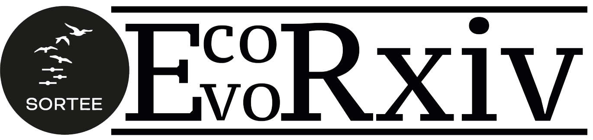

```{r setup, include=FALSE}
knitr::opts_chunk$set(results = 'asis' , eval = TRUE)
options(digits=2)
```



`r Sys.Date()`

<summary style=font-size:20px> *Preprint repository from SORTEE: the Society for Open, Reliable, and Transparent Ecology and Evolutionary biology* </summary>

# Welcome to EcoEvoRxiv!

EcoEvoRxiv is an open-access pre-print server for ecological and evolutionary research. Our goal is to facilitate researchers sharing their findings before formal publication by providing a platform for cutting-edge research in the fields of ecology and evolutionary biology.     

## Why use a pre-print server?

#### They’re quick!

Preprints are a way of disseminating your findings before a long [peer-reviewed process](https://www.nature.com/articles/530148a). This means your work won’t be out of date by the time people read it. 
  
#### Open access

Your work can reach researchers and others who do not have access to pay walled publications.    

#### Improved science

Once you’ve posted a preprint, other researchers may offer feedback on it via email or social media.It is a chance to catch mistakes, improve clarity and grow, before it’s committed to publication.   

#### Citations

Preprints can be cited, and can be used to establish precedence of your work.   


### Contact Us

For inquiries, please reach out to [ecoevorxiv@gmail.com](ecoevorxiv@gmail.com).  

### Follow Us

Stay updated by following us on [](https://twitter.com/EcoEvoRxiv)  


<!--chapter:end:index.Rmd-->

# Submit preprints

EcoEvoRxiv provides a platform for researchers to share their research before formal peer review. By submitting a preprint, you can quickly disseminate your findings, receive early feedback, and enhance the visibility of your work. Our goal is to make the submission process as straightforward as possible, helping you engage with your peers and contribute to ongoing discussions in ecology and evolution.   

### Basic rules

EcoEvoRxiv welcomes preprints across all areas of ecology and evolution. Each submission undergoes a review process by our editorial team to ensure it aligns with our repository’s policy.   

### Submitting a preprint

For step-by-step guidance on submitting a preprint, please watch our [tutorial video](https://www.youtube.com/watch?v=CUSbYNNrXuU).  

<!--chapter:end:01_submit_preprint.Rmd-->

# Modify submissions 

At EcoEvoRxiv, we recognize that manuscripts often evolve, particularly after peer review. Our platform allows authors to update their accepted and published preprints, ensuring that the most current version of your research is always available to the community. 

### Updating or modifying your manuscript

For step-by-step guidance on updating your preprint, please watch our [tutorial video](). 


<!--chapter:end:02_modify_submission.Rmd-->

