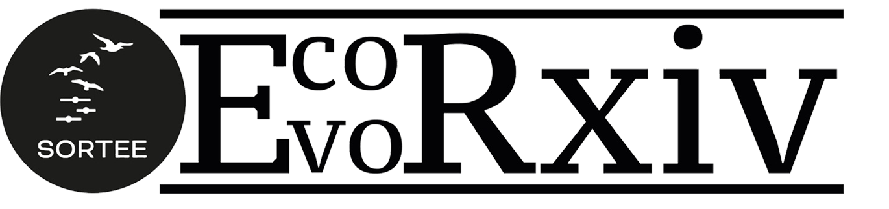

```{r setup, include=FALSE}
knitr::opts_chunk$set(results = 'asis' , eval = TRUE)
options(digits=2)
```

<summary style=font-size:20px> *Preprint repository from SORTEE: the Society for Open, Reliable, and Transparent Ecology and Evolutionary biology* </summary>

# Welcome to EcoEvoRxiv!

EcoEvoRxiv is an open-access pre-print server for ecological and evolutionary research. Our goal is to facilitate researchers sharing their findings before formal publication by providing a platform for cutting-edge research in the fields of ecology and evolutionary biology.     

## Why use a pre-print server?

#### They’re quick!

Preprints are a way of disseminating your findings before a long [peer-reviewed process](https://www.nature.com/articles/530148a). This means your work won’t be out of date by the time people read it. 
  
#### Open access

Your work can reach researchers and others who do not have access to pay walled publications.    

#### Improved science

Once you’ve posted a preprint, other researchers may offer feedback on it via email or social media.It is a chance to catch mistakes, improve clarity and grow, before it’s committed to publication.   

#### Citations

Preprints can be cited, and can be used to establish precedence of your work.   


### Contact Us

For inquiries, please reach out to [ecoevorxiv@gmail.com](ecoevorxiv@gmail.com).  

### Follow Us

Stay updated by following us on [](https://twitter.com/EcoEvoRxiv)  

```{js, echo = FALSE}
title=document.getElementById('header');
title.innerHTML = '' + title.innerHTML
```